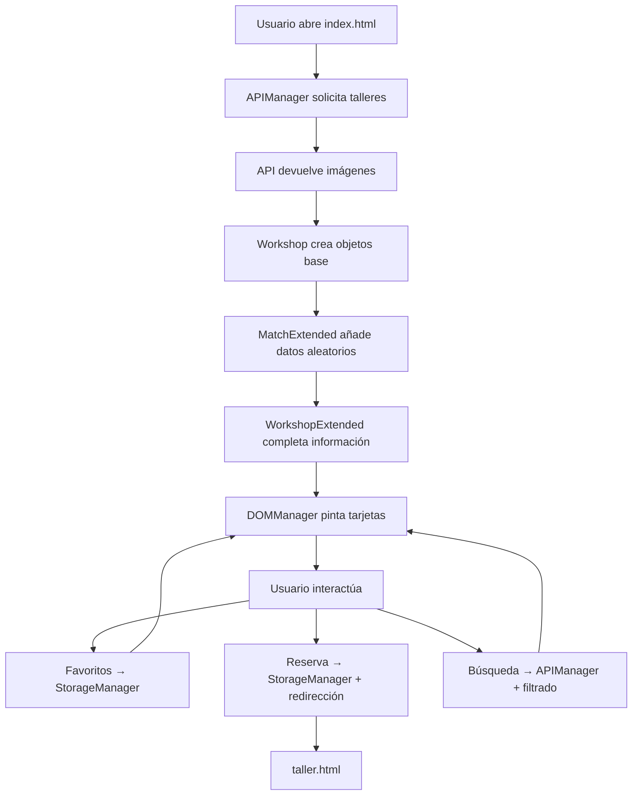

# creActive
  
## Descripción
Plataforma donde encontrar y reservar talleres creativos (dibujo, cerámica, música, textil, etc.). Los talleres se generan combinando datos de una API de imágenes con información local enriquecida.  
Está dirigido a:  
El usuario: que busca y se apunta al taller creativo  
El profesor: quien imparte el taller, puede o no disponer del espacio donde realizarlo  
El centro: espacio donde se realizará la actividad creativa.  
  
* **Funcionalidades Core (MVP)**  
Listado de talleres aleatorios en la página principal  
Búsqueda de talleres por ciudad  
Vista del detalle del taller  
Sistema de favoritos guardados en localstorage (id)  
Sistema de reserva de talleres (guardado array en localStorage)  
Galeria de imágenes en la vista detalle  
  
* **Funcionalidades Adicionales**  
Enriquecimiento de datos con información local (workshopExtended)  
Asignación aleatoria del contenido (matchExtended)  
  
## Estructura del Prototipo  
Vistas creadas:  
* **index.html:** Listado principal de talleres  
* **taller.html:** Detalle del taller  
  
Lógica principal:  
* **index.js:** control de la vista principal  
* **taller.js:** control de la vista detalle  
  
Getión de datos:  
* **APIManager.js:** llamadas a la API: imágenes, galeria  
* **workshopExtended.js:** informacion adicional de talleres  
* **matchExtended.js:** asignación aleatoria de datos  
  
Modelo y estructura de talleres  
* **Workshop.js:** clases de creación de taller gestion de colección y favoritos.  
  
Interacción:  
* **Listeners.js:** enentos de usuario (favoritos, reserva, búsqueda)  
* **DOMManager.js** renderizado de pantalla  
  
Persistencia  
* **StorageManager** gestion de localStorage (favoritos y taller)  
  
Estilos  
* **styles.css:** estilos generales, diseño responsive mediante queries  
    
## Tecnologías Utilizadas  


  
  
## Árbol de archivos   
```text
creActive/
│
├── css/                # Estilos del proyecto
│   └── styles.css
│
├── js/                # Lógica principal en JavaScript
│   ├── index.js
│   ├── taller.js
│   ├── APIManager.js
│   ├── DOMManager.js
│   ├── Listeners.js
│   ├── StorageManager.js
│   ├── Workshop.js
│   ├── workshopExtended.js
│   └── matchExtended.js
│
├── img/ui/            # Recursos gráficos e interfaz
│
├── index.html         # Página principal
└── taller.html        # Página de detalle
``` 
  
## Enfoque Técnico  
* Consumo de API pexels mediante fetch  
* Programación orientada a objetos (POO)  
* Manipulación del DOM  
* Gestión de eventos con addEventListener  
* Uso de localStorage  
* separacion modular de código en responsabilidades  
  
## Flujo de aplicación   
1. se obtienen imágenes desde la API  
2. se genera talleres con Workshop  
3. se enriquece con datos de workshopExtended  
4. se asignan datos aleatorios con matchExtended  
5. se renderiza con DOM  
6. el usuario interactura con:  
   * Favoritos  
   * Búsqueda  
   * Reserva (detalle taller)  
  

  
## Mejoras futuras   
Mejora sistema de reservas  
Persitencia robusta de favoritos  
Optimizacion de estructura de clases  
Apliar formulacios de búsqueda  
  
## Como ejecutar el proyecto  
Abrir index en el navegador, no reguiere instalación adicional, pero si se necesita KEY de API pexels que deben integrarse como se indica en el archivo apiKey-example.js y debe renombrarse como apiKey.js  

## Autor  
* **[Montse](https://github.com/Montse-gj)**  
